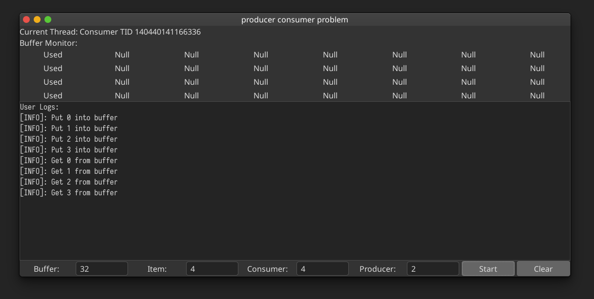

# Producer-consumer GTK3

First assignment for 2020 OS course, SSE, Tongji Univ

github@akenonet.com
## Development Environment

- Intel Core i5-7200u (Kaby Lake)
- Debian GNU/Linux testing(bullseye) 5.5.0-amd64
- clang 9.0.1
- gdb 9.1
- glade 3.22.2

## Dependencies

- pkg-config
- libgtk-3-dev

## Build & Run

You can manually change log level defined in source file.

```bash
./build.sh
./producer-consumer-gtk3
```

**NOTE:** 

I have only built and tested it on my own Debian machine, not sure about the compatibility with Windows and macOS.

~~I am so sad that I can not afford one of them.~~

Tons of GTK and GDK utilities were put into this project.


## Screenshot

Intuitive UI doesn't need to be explained.



## How does it work

GTK facilities maintain the main thread which is basically an event-driven UI, while my multi-thread heavy workloads are designed to be **asynchronous**. GTK has `g_timeout_add`, adding my own `event_pool` and `slowmotion_clock` we got a call wheel.

The rest part is generally old-fashioned solution to producer-consumer problem, using two condition variables and one mutex.

## Synchronous primitives

Why not binary semaphore aka Dijkstra's `P()` and `V()`

I am working on a **monolithic kernel** based system. 

Take a look at [FreeBSD Manual](https://www.freebsd.org/cgi/man.cgi?query=sema&sektion=9&manpath=freebsd-release-ports)

>Semaphores should not be used where mutexes and condition variables will suffice. Semaphores are a	more complex synchronization mechanism than mutexes and condition variables, and are not as efficient.

And its other drawbacks were explained in [Sticky Bits Blog](https://blog.feabhas.com/2009/09/mutex-vs-semaphores-%e2%80%93-part-1-semaphores/)

>Unfortunately “misusing” the semaphore as synchronization primitive can be problematic in that it makes debugging harder and increase the potential to miss “accidental release” type problems.